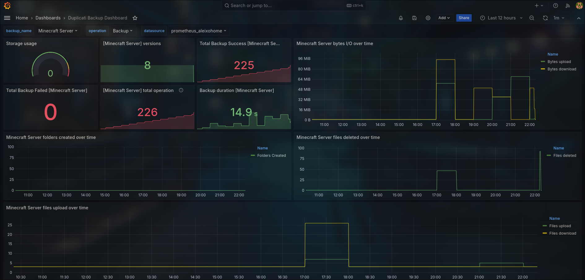

# Duplicati prometheus exporter
This is an simple exporter made for [Duplicati backup](https://duplicati.com).

## How it works
On your Duplicati backup interface or cli, you can configure in advanced options parameters for `"send-http"`, with this configuration, Duplicati will send an post request to this exporter; so then exporter will gather metrics receved and expose a /metrics for `prometheus`.

```bash
# Cli configuration example
--send-http-url=http://<duplicati-exporter-instance>:5000/
--send-http-result-output-format=Json
--send-http-any-operation=true
```

## Setup demo
For this demo is needed to be installed docker in your machine. How demo is setting up duplicati prometheus exporter app, prometheus and grafana, besides that, there is a configuration container that configure grafana datasource and dashboard, after that, this container send an example post to duplicati example exporter, you can see the configuration on [docker compose file](docker-compose.yml).
- In repository root, run:
> docker compose up --force-recreate --build --always-recreate-deps
- After ~15 seconds the address `http://localhost:3000` should be ready. Go to [Grafana in your localhost](http://localhost:3000/d/ddmio2e27ctmod/duplicati-backup-dashboard)
> http://localhost:3000/d/ddmio2e27ctmod/duplicati-backup-dashboard



~This dashboard can change while i'm developing and improving.

## Prometheus scrap config example
```yaml
global:
  scrape_interval: 60s
  evaluation_interval: 30s
scrape_configs:
- job_name: duplicati_backup
  honor_labels: true
  static_configs:
  - targets: ['duplicati-prometheus-exporter:5000'] # you can change to set your exporter instance
```

## Run duplicati prometheus exporter using docker
Docker is the better way to execute this application. If you prefer, you can build your own
container image based on my [Dockerfile](Dockerfile) to change anythong you want and store your
container artifact where you need; but you also can use my docker image that is on my [dockerhub](https://hub.docker.com/repository/docker/aleixolucas/duplicati-prometheus-exporter/general)

- Running docker image
> docker run -p 5000:5000 aleixolucas/duplicati-prometheus-exporter

- After container run successfully you can access http://127.0.0.1/metrics (Change localhost ip if necessary).

## Running with python 
For this you have to install python3.9 or higher. You can change service port by setting a environment variable `DUPLICATI_EXPORTER_PORT=PORT`, default is 5000.

- In repository root, create an python venv
> python -m venv .venv
- Then activate this venv

> source .venv/bin/activate # Linux

> C:\ .venv\Scripts\activate.bat # Window
- Install python packages required
> pip install -r requirements.txt
> python -m venv .venv
- Finally
> python duplicat-prometheus-exporter

## DEBUG
Debug can be done by using LOG_LEVEL environment variable, supported values:
`DEBUG`, `INFO`, `WARNING`, `ERROR`, `CRITICAL`.

## PULL REQUESTS
Hello everyone, i'm developing from scratch and I have no much experience with prometheus library, feel free to send any issues or open any pull requests to improve the source code. Any help is welcome (:

